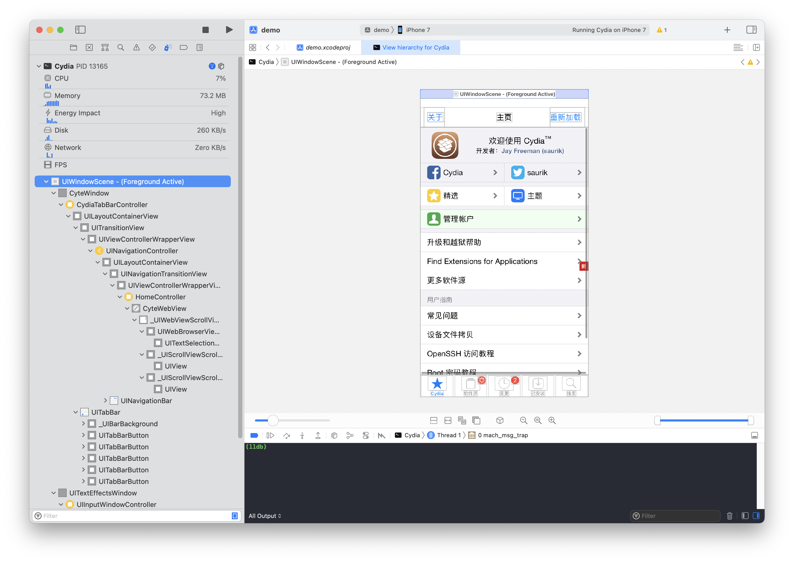

# XcodeRootDebug

[English](https://github.com/lemon4ex/XcodeRootDebug/blob/main/README.md)

允许`xcode`使用`root`权限启动自定义的`debugserver`调试iOS应用。

目前只在以下越狱设备上进行了测试：

* iPhone 6s 14.2
* iPhone 7 13.6.1
* iPhone 7 15.6.1
* iPhone X 16.6.1
* iPhone 11 Pro 14.2

理论上支持iOS10以上设备，包括A12。

Cydia 源：https://repo.byteage.com

# 使用

## 安装
1. 添加源`https://repo.byteage.com`，直接安装
2. 下载源码，编译安装

## 配置
1. 打开手机设置，找到`XcodeRootDebug`插件设置，启用插件和ROOT权限开关，设置`Debug Server`为`/usr/bin/debugserver`，保存设置
2. 根据设备系统版本，在`Xcode`中找到对应的dmg文件，如`/Applications/Xcode.app/Contents/Developer/Platforms/iPhoneOS.platform/DeviceSupport/14.3/DeveloperDiskImage.dmg`
3. 双击dmg挂载，将`/Volumes/DeveloperDiskImage/usr/bin/debugserver`复制一份到`~/Desktop/debugserver`
4. 复制下面的内容，保存到`~/Desktop/debugserver.entitlements`
```xml
<?xml version="1.0" encoding="UTF-8"?>
<!DOCTYPE plist PUBLIC "-//Apple//DTD PLIST 1.0//EN" "http://www.apple.com/DTDs/PropertyList-1.0.dtd">
<plist version="1.0">
<dict>
	<key>com.apple.springboard.debugapplications</key>
	<true/>
	<key>com.apple.backboardd.launchapplications</key>
	<true/>
	<key>com.apple.backboardd.debugapplications</key>
	<true/>
	<key>com.apple.frontboard.launchapplications</key>
	<true/>
	<key>com.apple.frontboard.debugapplications</key>
	<true/>
	<key>com.apple.private.logging.diagnostic</key>
	<true/>
	<key>com.apple.security.network.server</key>
	<true/>
	<key>com.apple.security.network.client</key>
	<true/>
	<key>com.apple.private.memorystatus</key>
	<true/>
	<key>com.apple.private.cs.debugger</key>
	<true/>
	<key>com.apple.private.thread-set-state</key>
	<true/>
	<key>com.apple.private.security.no-container</key>
	<true/>
	<key>com.apple.private.skip-library-validation</key>
	<true/>
	<key>com.apple.system-task-ports</key>
	<true/>
	<key>get-task-allow</key>
	<true/>
	<key>platform-application</key>
	<true/>
	<key>run-unsigned-code</key>
	<true/>
	<key>task_for_pid-allow</key>
	<true/>
</dict>
</plist>
```
5. 使用`ldid`给`debugserver`签上新的权限
```shell
cd ~/Desktop
ldid -Sdebugserver.entitlements debugserver
```
6. 将签名好的`debugserver`复制到越狱设备的`/usr/bin/debugserver`路径下，并使用root用户给它可执行权限
```shell
chmod +x /usr/bin/debugserver
```
7. 执行`debugserver`，确保能够正常运行
```shell
iPhone-X:~ root# debugserver
debugserver-@(#)PROGRAM:LLDB  PROJECT:lldb-1403.2.3.13
 for arm64.
Usage:
  debugserver host:port [program-name program-arg1 program-arg2 ...]
  debugserver /path/file [program-name program-arg1 program-arg2 ...]
  debugserver host:port --attach=<pid>
  debugserver /path/file --attach=<pid>
  debugserver host:port --attach=<process_name>
  debugserver /path/file --attach=<process_name>
```
8. 在越狱设备上重启`lockdownd`
```shell
killall lockdownd
```
9. 将越狱设备连接电脑，打开`Xcode`，使用菜单`Debug->Attach to Process by PID or Name ...`或`Debug->Attach to Process`附加到想要调试的任何进程

## 已知问题
* 使用 [Palera1n](https://palera.in/) 越狱的设备，一定要安装官方源`palera1n strap`里的`ldid`，然后将`debugserver.entitlements`和`debugserver`拷贝到越狱设备中，并在越狱设备上执行`ldid -Sdebugserver.entitlements debugserver`命令，否则`debugserver`无法启动。官方源的`ldid`经过修改，使用它对可执行程序签名才能使命令行工具正常执行，否则会报错。
* 有其他问题欢迎提交issue

# 背景

通常情况下，我们使用`xcode`进行真机调试时有如下限制:

1. 只能以`mobile`权限启动调试器
2. 启动的调试器只能是`/Developer/usr/bin/debugserver`

基于上面的限制，产生了以下问题：

1. 无法调试系统进程，如：`Cydia`、`Safiri`
2. 无法调试`AppStore`下载的应用，应用需要砸壳后重签名

要解决上面的问题，需要使用具有高权限的`debugserver`，具体的配置过程，可以参考文章 [iOS12 下配置debugserver + lldb调试环境的小技巧和问题处理](https://iosre.com/t/ios12-debugserver-lldb/14429)。

要解决上面的限制，就需要安装本插件。

安装本插件以后，将允许开发者使用`xcode`以`root`权限启动自定义的`debugserver`进行调试。

你可以在设置中对插件进行设置。

# 文章
* [让 Xcode 支持使用 root 权限调试 iOS 设备上的任何应用或进程](https://byteage.com/154.html?from=github)

# 截图


